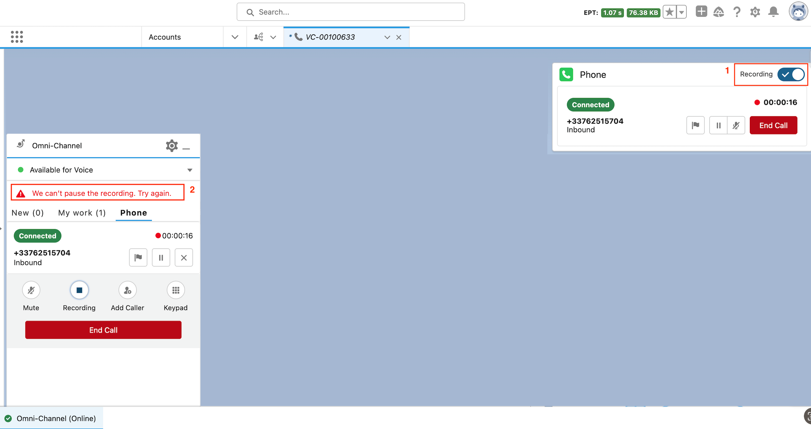
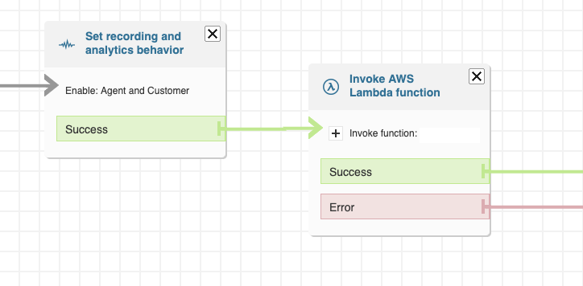
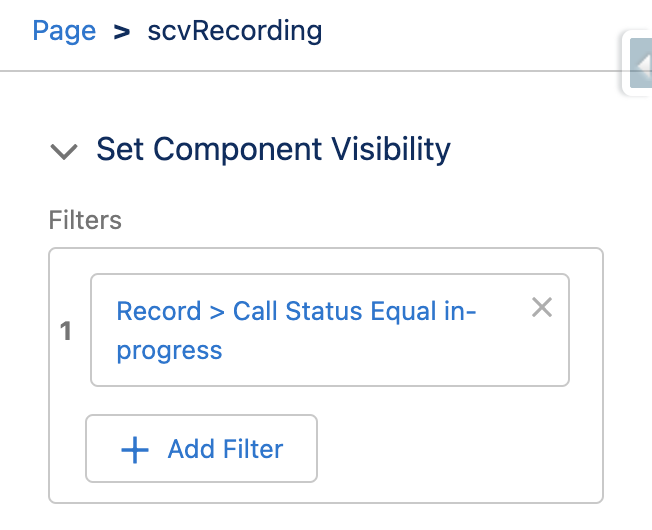

# Service Cloud Voice Recording LWC

> **TL;DR** The solution is intended to be used in a Service Cloud Voice with Amazon Connect implementation
> As of today, the standard recording functionality in Salesforce is limited due to some Amazon Connect restrictions. The solution consists in using a custom component to handle the recording, that will call the Amazon Connect APIs based on the recording status stored in a custom field

> **Disclaimer**: This is not an official Salesforce solution, but an open-source project aiming to cover a gap in the current out-of-the-box functionality. Contributions to this project are welcome

<div align="center">
    
</div>

## Context

When using the [standard Service Cloud Voice (SCV) recording functionality](https://help.salesforce.com/s/articleView?language=en_US&id=sf.voice_agents_record_calls.htm&type=5), the users will face the following limitations:

1.  The recording toggle is always active for all calls, even if the current call is not being recorded
2.  An agent cannot start a recording if it was not initially started in the Amazon Connect contact flow
3.  For a recorded call, the toggle will pause the recording (empty audio) but the agent doesn’t have the option to fully stop it.

The explanation behind this behavior is that:

- The recording has to be initiated in an Amazon Connect contact flow
- During a call, there is no way to know whether a call is being recorded or not (Amazon doesn’t expose this information and there isn’t any API to retrieve it). The only available APIs are:

  - [StartContactRecording](https://docs.aws.amazon.com/connect/latest/APIReference/API_StartContactRecording.html 'https://docs.aws.amazon.com/connect/latest/APIReference/API_StartContactRecording.html')
  - [SuspendContactRecording](https://docs.aws.amazon.com/connect/latest/APIReference/API_SuspendContactRecording.html 'https://docs.aws.amazon.com/connect/latest/APIReference/API_SuspendContactRecording.html')
  - [ResumeContactRecording](https://docs.aws.amazon.com/connect/latest/APIReference/API_ResumeContactRecording.html 'https://docs.aws.amazon.com/connect/latest/APIReference/API_ResumeContactRecording.html')
  - [StopContactRecording](https://docs.aws.amazon.com/connect/latest/APIReference/API_StopContactRecording.html 'https://docs.aws.amazon.com/connect/latest/APIReference/API_StopContactRecording.html')

- The “Control Call Recording” permission in Salesforce will then display the recording toggle always as active by default
- When the call is not recorded, the toggle is displayed as active. If the agent tries to deactivate it, the component will call the “SuspendContactRecording” API which will fail and an error will be displayed, as there is no current call being recorded that could be suspended. The toggle will remain active.

<div align="center">
    
</div>

## How to use it

### Deploy the elements to your org (force-app package, or see the list of specific metadatas in them manifest/package.xml)

- LWC - scvRecording - The LWC to display the recording controls in the page
- Apex Class - SCVRecording - The Apex controller used by the LWC to perform API callouts to Amazon Connect
- Named Credential - AmazonConnect - To securely store the Amazon Connect API callout configuration
- Custom Field - VoiceCall.RecordingStatus\_\_c - A picklist field to store the status of the recording. This field will contain the values: not_started (default), in_progress, suspended, stopped

### Configure the Named Credential

Go to Salesforce Setup > Named Credentials > Amazon Connect and click on Edit. Configure the following information:

- **AWS Access Key ID**: a valid access key of an AWS user with API rights
- **AWS Secret Access Key**: a valid access key of an AWS user with API rights

### Update your contact flow to initialize the recording status

In order to notify Salesforce that a recording has been initiated for the VoiceCall, each time the recording is enabled in Amazon Connect, you need to set the RecordingStatus\_\_c = in_progress value in the VoiceCall record.

To do so, modify your contact flows (or modules) in Amazon Connect to invoke the [InvokeSalesforceRestApiFunction Lambda Function](https://developer.salesforce.com/docs/atlas.en-us.voice_developer_guide.meta/voice_developer_guide/voice_lambda_invokesalesforcerestapi.htm) right after you have enabled the recording using the "Set Recording and Analytics Behavior" block, with the following attributes:

- methodName = updateRecord (Set manually)
- objectApiName = VoiceCall (Set manually)
- recordId = voiceCallId (Set dynamically - User defined - a reference to the VoiceCall Id you stored after using the CreateVoice call lambda)
- RecordingStatus\_\_c = in_progress (Set manually)

> **IMPORTANT** Before using the InvokeSalesforceRestApiFunction lambda, make sure that the integration is correctly setup for the instance: Service Cloud Voice Authentication When Using InvokeSalesforceRestApiFunction

<div align="center">
    
</div>

### Add the component to your page

The component contains 4 buttons to: Start, Resume, Suspend and Stop the recording. The visibility of each of this buttons depends on the RecordingStatus\_\_c field of the VoiceCall record:

- Start - only visible if the recording has not started
<div align="center">
    
</div>

- Suspend - only visible if the recording is in progress
<div align="center">
    
</div>

- Resume - only visible if the recording is suspended
<div align="center">
    
</div>

- Stop - only visible if the recording is in progress or suspended. Once a call is stopped, any other recording action can be performed.
<div align="center">
    
</div>

Clicking on the buttons will trigger an API call to Amazon Connect with the specific action and will update the RecordingStatus\_\_c field on the VoiceCall with the new value

- Start

  - API callout: StartContactRecording
  - New status after callout success: RecordingStatus\_\_c = in_progress

- Suspend

  - API callout: SuspendContactRecording
  - New status after callout success: RecordingStatus\_\_c = suspended

- Resume

  - API callout: ResumeContactRecording
  - New status after callout success: RecordingStatus\_\_c = in_progress

- Stop
  - API callout: StopContactRecording
  - New status after callout success: RecordingStatus\_\_c = stopped

**Error handling**: if the callouts or the update of the VoiceCall field returns an error, a toast with the message will be displayed

### Set the component visibility on the page

The recording actions can only be triggered for a call in progress (once it’s been connected to an agent).

In order to prevent the user clicking on the buttons when the call context is not ready yet, two visibility mechanisms are in place:

- Define a component visibility to be displayed only when the call is in progress

<div align="center">
    
</div>

- The component also leverages the Service Cloud Toolkit API, to render the markup only when the callconnected component is triggered

  - Because of the Agent whisper flow, when the agent accepts the call (event: callaccepted) the whisper flow happens but the call is not connected yet. At this point, trying to interact with the recording will return an error.

  - Once the whisper flow has finished and the call is connected (event: callconnected) the recording interactions become available

### Create a Trigger on the VoiceCall object to handle call transfers

When a adding a caller to an existing VoiceCall, the newly created VoiceCall (transfer) will inherit the recording status of the first one.

- If the recording for the first call is in progress or suspended, the transfer VoiceCall will have a recording active by default

- If the recording for the first call has not been initiated or it has been stopped, the transfer VoiceCall will not have a recording activated by default

As the recording logic of the component is based on the new RecordingStatus\_\_c field, you need to add a new trigger on the VoiceCall record of type transfer to inherit the value from the original VoiceCall with the following logic:

- If the previous call RecordingStatus**c is “in_progress” or “suspended” → the new transfer VoiceCall will have a RecordingStatus**c = “in_progress”

- If the previous call RecordingStatus**c is “not_started” or “stopped” → the new transfer VoiceCall will have a RecordingStatus**c = “not_started”

```
// NOTE: The example below is just a basic boilerplate that should be reviewed and adapted to the specific Trigger framework used
trigger VoiceCallTrigger on VoiceCall (before insert) {

  ...
  if(newVoiceCall.CallType == 'Transfer'){
    String previousCallRecording = newVoiceCall.PreviousCall.RecordingStatus__c;

    if(previousCallRecording == 'in_progress' || previousCallRecording == 'suspended'){
      newVoiceCall.RecordingStatus__c = 'in_progress';
    }else{
      newVoiceCall.RecordingStatus__c = 'not_started';
    }
  }
  ...
}
```
